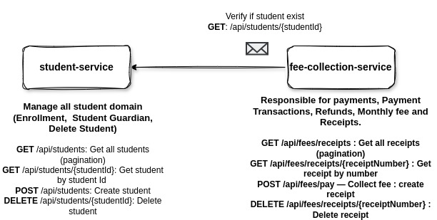
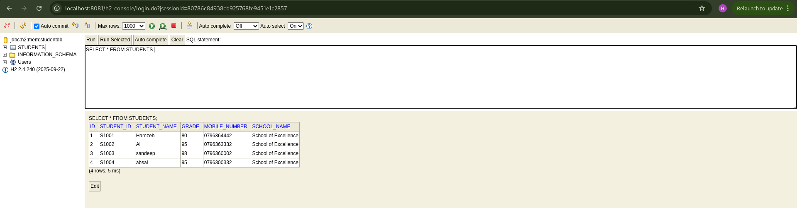
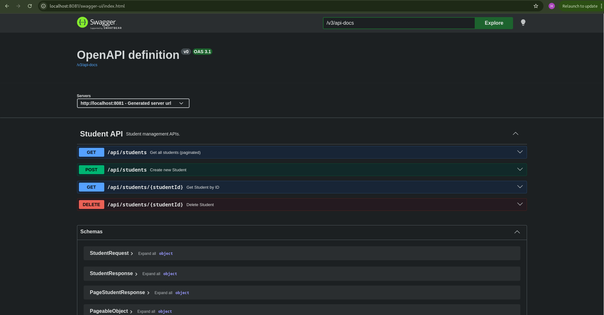
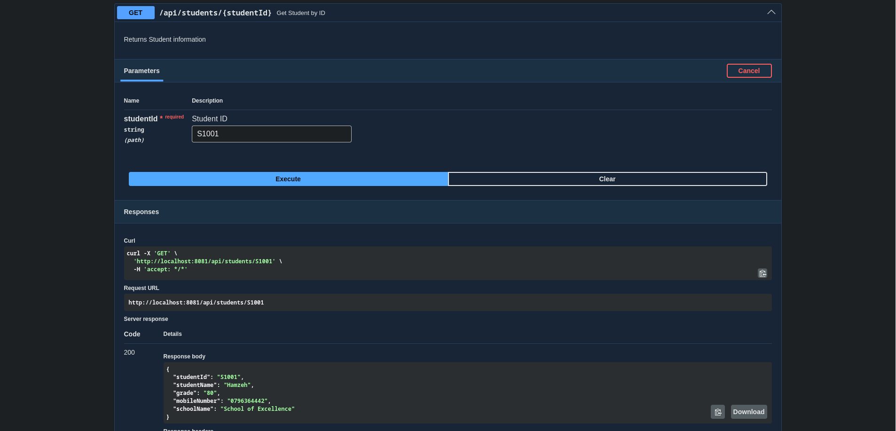

# student-service

## Overview

The **Student Service** manages student records and provides REST APIs
to `create`, `retrieve`, and `delete students`.\

This service supposed to do all belong to the Student domain. For example manage additional student meta data like `student_address`, `enrollments`, or `manage guardians`,

It acts as the **source of truth for student information**, which can
later be referenced by other services, Like: `fee-collection-service`.

For now, Each student record contains: - Student ID - Student Name - Grade -
Mobile Number - School Name

------------------------------------------------------------------------

## Service Relationship



The Student Service manages student data and provides the `studentId`
that is used by the `fee-collection-service`.

------------------------------------------------------------------------

## Tech Stack
-   Java 21
-   Spring Boot 4.0.3
-   Spring Data JPA
-   H2 Database
-   SLF4J Logging
-   Lombok
-   Swagger v3.0.2/ OpenAPI Documentation
-   JUnit 5 (Testing)

------------------------------------------------------------------------

## Current API Endpoints:
| Method   | URL                       | Description                  |                                                       
|----------|---------------------------|------------------------------|
| GET      | /api/students             | Get all students (paginated) |
| GET      | /api/students/{studentId} | Get Student by student Id    |
| POST     | /api/students             | Create a new student|
| DELETE   | /api/students/{studentId} | Delete a student|

------------------------------------------------------------------------

## Running the Service Locally

The service runs on:

http://localhost:8081

### Start the Service

``` bash
mvn spring-boot:run
```

or

``` bash
./mvnw spring-boot:run
```

------------------------------------------------------------------------

## H2 Database Console

After starting the service you can access:

http://localhost:8081/h2-console

Example configuration:

-   JDBC URL: jdbc:h2:mem:studentdb
-   Username: sa
-   Password: 



------------------------------------------------------------------------

## Swagger API Documentation

Swagger UI:

http://localhost:8081/swagger-ui/index.html

1- 
2- 
------------------------------------------------------------------------

## Postman Collection

A Postman collection is provided for testing the APIs available in:

- /**postman**/student-service.postman_collection.json

Examples: GET All Students, GTE Students, POST Create Student, DELETE Student

------------------------------------------------------------------------

## Future Work

Possible future improvements:

-   Expand the domain with additional tables:
    -   Student Address
    -   Add Parent/Guardian Information
    -   Enrollment Records
-   Add validation and more business rules
-   Introduce caching for frequently accessed data
-   Implement asynchronous communication using **Kafka**
-   Add centralized logging and monitoring
-   Increase integration and unit testing coverage